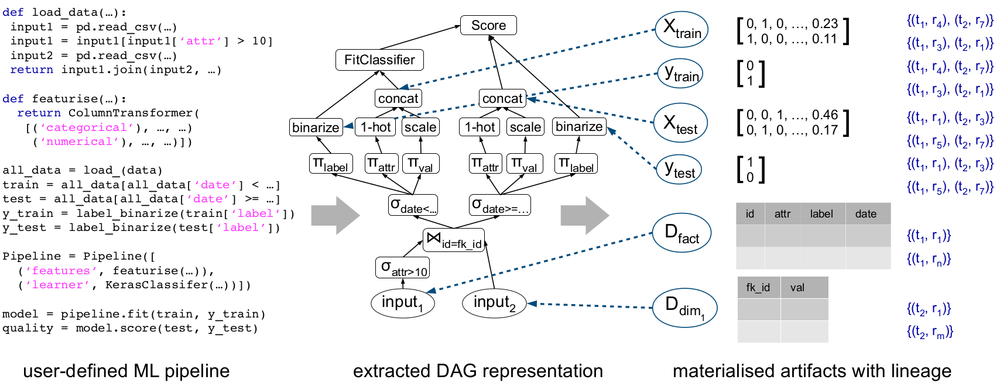

## ArgusEyes

The idea of ArgusEyes is to use [mlinspect](https://github.com/stefan-grafberger/mlinspect) to extract the intermediate results and their lineage from native ML pipelines, and enable a set of automated issue detection and data refinement techniques.

We provide a couple of [example pipelines and configurations](arguseyes/example_pipelines) to showcase the usage of ArgusEyes (note that you can run `mlflow ui --backend-store-uri ./mlruns` from the project root to view the captured artifacts and issue detection results). 

Furthermore, we setup an [example project](https://github.com/schelterlabs/arguseyes-example/actions) which demonstrates how to integrate ArgusEyes into a [github CI workflow](https://docs.github.com/en/actions).

## Local setup

Prerequisite: Python 3.9

1. Clone this repository
2. Set up the environment

	`cd arguseyes`  
	`python -m venv venv`  
	`source venv/bin/activate`  

3. Install graphviz

    `Linux: ` `apt-get install graphviz`  
    `MAC OS: ` `brew install graphviz`  
	
4. Install pip dependencies 

    `pip install -r requirements.txt`  

